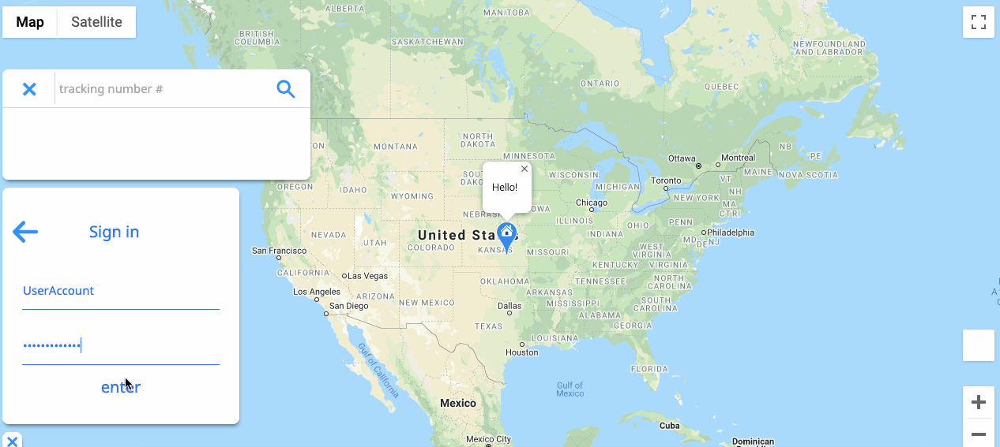

# Mail Tracker - Single Page Application

Mail Tracker allows users to interact with a dynamic map provided by the Google Maps API in order to track the current whereabouts of up to 10 packages. This application includes support for 12 popular shipping carriers, and allows users to mark a home position on the map in order to see where packages are located relative to their destination. All information is served to the frontend using a Rails API that handles information from 3 separate APIs.

# Supported carriers

* UPS
* FedEx
* FedEx Smartpost
* USPS
* Canada Post
* DHL
* UPS Mail Innovations
* DHL Global Mail
* LaserShip
* OnTrac
* Amazon
* A1 International
* Prestige

# Built Using

* [Google Maps API](https://developers.google.com/maps/documentation/javascript/tutorial)
* [Google Geocoding API](https://developers.google.com/maps/documentation/geocoding/start)
* [Shipit Test API](https://www.npmjs.com/package/shipit)

# License

This project is licensed under the MIT License - see the LICENSE.md file for details
